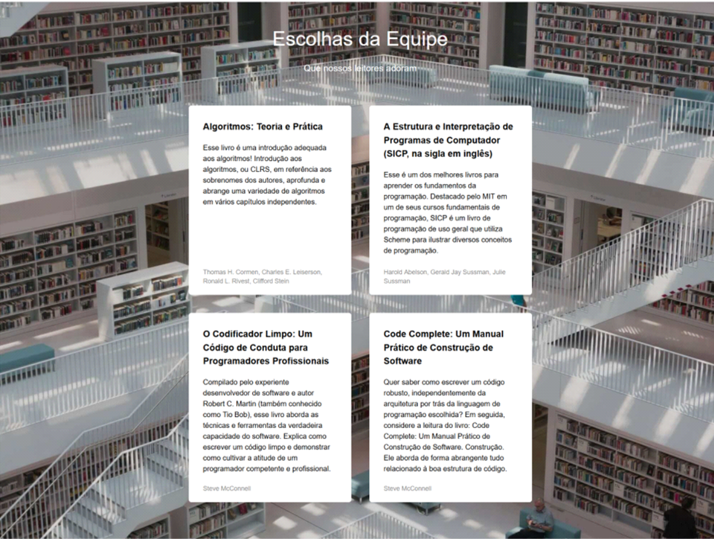

# Projeto: Biblioteca Triple Peaks

Trata-se do segundo projeto do bootcamp de desenvolvimento web da TripleTen, com o objetivo de elaborar uma página da biblioteca Triple Peaks.

## Ferramentas utilizadas

    <a href="https://reactjs.org/" target="_blank" rel="noreferrer">

## Novos conhecimentos

- HTML semântico;
- uso do position no CSS;

## Melhorias a serem implementadas

1. Adicionar responsividade para outros tamanhos de tela;
2. Mais interatividade para o usuário

#### Resultado final

  
  

